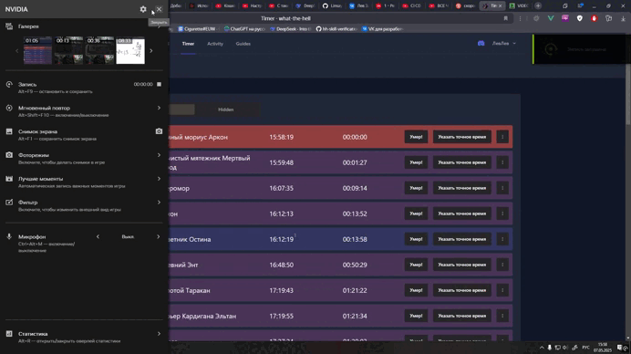

# Boss Timer for Royal Quest

Веб-приложение для отслеживания времени возрождения боссов в MMORPG игре Royal Quest. Создано для гильдии "What the
Hell" для отслеживания респавна боссов.

## Демонстрация

Сайт в данный момент функционирует по адресу https://what-the-hell.ru/

## Основные возможности

- Таймеры возрождения боссов с визуальным отображением
- Уведомления о скором появлении боссов
- История убийств боссов
- Удобный интерфейс для управления таймерами
- Автоматический расчёт времени возрождения
- Возможность ручной корректировки таймеров
- Разделение прав для редактирования и просмотра таймера

## Для обновления файлов хостинга

1. Обновите `master` до нужного состояния
2. Сделайте `npm run build` у себя локально
3. Перейдите на хостинг и в папке с проектом сделайте `git pull`
4. После этого выполните миграции `php artisan migrate`
5. (Так же запустите сидеры если требуется)
6. Удалите старый build на проекте, и загрузите новый
7. Обновите папку assets, если требуется
8. Запустите `php artisan optimize`

## Если вы разворачиваете у себя проект

1. Клонируйте проект `git clone https://github.com/Linsaym/WhatTheHell`
2. Установите все модули `composer install` & `npm install`
3. Создайте .env из .env.example и сгенерируйте ключ `php artisan key:generate`
4. Выполните все миграции `php artisan migrate`
5. Выполните все нужные сидеры из /database/seeders

P.s. У вас должен быть установлен <a href="https://getcomposer.org/">Composer</a> и <a href="https://getcomposer.org/">
Node.js</a>,
 
а так же поднят MySQL и Apache(PHP). Сделать это можно с помощью <a href="https://www.apachefriends.org/ru/index.html">
XAMPP</a>
